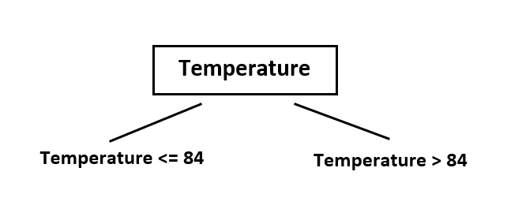

# Section 1: Decision Tree  
Decision tree is a supervised machine learning model used in data mining. The goal is to create a model that predicts the value of a target variable based on several input variables. Tree based models empower predictive models with high accuracy, stability and ease of interpretation.

 

  
  
## 1.1 Basic background of decision tree model  
  
### 1.1.1 Two types of decision trees  
Types of decision tree is based on the type of target variable we use.  
  
a. __Classification Trees__: A tree with categorical target variable is called classification or categorical decition tree. Such as True/False, Yes/No, education levels.    
b. __Regression Trees__: A tree with continuous target variable(typically real numbers) is called regression tree. Such as income, area.  
  
### 1.1.2 Important Terminology related to Decision Trees  
1. __Root Node__: The topmost decision node in a tree which corresponds to the best predictor called root node.  
2. __Splitting__: The process of dividing a node into two or more sub-nodes.  
3. __Decision Node__: When a sub-node splits into further sub-nodes, then it is called decision node.  
4. __Leaf/Terminal Node__: Nodes that do not split anymore is called leaf or terminal node.  
5. __Brance/Sub-Tree__: A sub section of entire tree is called a branch or sub-tree.  
6. __Pruning__: Removing sub-nodes of a decision node called pruning, it's the opposite process of splitting.  
7. __Parent and Child Node__: A node which is divided into sub-nodes is called parent node of sub-nodes where as sub-nodes are the children of parent node.  

 

  

### 1.1.3 Advantages of tree model  
1. Easy to understand and interpret. Decision tree output is very easy to understand even for people without analytical background. No requirment of statistical knowledge to read and interpret them. Its graphical representation is very intuitive and users can easily relate their hypothesis.  
2. Useful in data exploration and variable selection. Decision tree is one of the fastest way to identify most significant variables and relation between two or more variables. With the help of decision tree, we can create new variables/features that has better power to predict target variable.  
3. Less data cleaning required. It required less data cleaning or preprocessing procedure compared to some other modeling method.  
4. Tree models have good robustness and stability. t is not influenced by outliers and missing values to a fair degree.  
5. Data type is not a constraint: It can handle both numerical and categorical variables.  
6. Non Parametric Method: Decision trees have no assumptions about the space distribution and the classifier structure.  
  
### 1.1.4 Disadvantages of tree model  
1. Over fitting. Over fitting is one of the most practical difficulty for decision tree models. This problem gets solved by setting constraints on model parameters and pruning (discussed in detailed below).  
2. Not fit for continuous variables: While working with continuous numerical variables, decision tree looses information when it categorizes variables in different categories.  
  
  
## 1.2 Tree spliting procedure  
Tree models follow a *top-down greedy* approach known as recursive binary splitting. We call it as ‘top-down’ because it begins from the top of tree when all the observations are available in a single region and successively splits the predictor space into two new branches. We call it as ‘greedy’ because the algorithm looks for best variable available in the current stage and only cares the current split.Future splits will not be considered even if it lead to a better tree.  
Generally, we want to increase the purity of a node. When the tree model is analysing an attribute to partition the data at the node, we want that each partition is as homogeneous as possible. This means we would like to see most of the instances in each partition belonging to as few classes as possible and each partition should be as large as possible. There are several ways or measurements we can generate to calculate the purity:
  
1. Entropy  
2. Gini Index  
3. Reduction in Reduction  
We will discuss more detail about each measurement and its relative model in the following part.  

The splitting process will continue until all leaves reach to maximum purity, or a user defined stopping criteria is reached. For example, we set the minimum number of a nude to 50, then once a node has less than 50 observations, spliting will stop on this node. Such splitting process results in a fully grown tree until the stopping criteria is reached. However, the fully grown tree is likely to overfit data, leading to poor accuracy. Pruning is one of the technique used tackle overfitting. We’ll learn more about it in a later section.
  
  
  
  
# Section 2: Entropy, ID3 & C4.5 algorithm  

## 2.1 Entropy  
**Entropy**, or **Information Entropy**, is the average rate at which information is produced by a stochastic source of data. The measure of information entropy associated with each possible data value is the negative logarithm of the probability mass function for the value. Generally, entropy refers to disorder or uncertainty. A data set with smaller entropy has greater certainty. Shannon defined the entropy\(\ H \)(Greek capital letter eta) of a discrete random variable $X$ with possible values $\{x_1,...,x_n\}$ and probability distribution function $P(X)$ is:  
  

$P(X=x_i) = p_i,\ i = 1,2,...,n$  

  
  
The Entropy can be written as:  

$H(X) = - \displaystyle\sum_{i= 1}^{n}p(x_i)log_2p(x_i)$  

  

When the log base equals to 2, then the corresponding units of entropy are the bits. Nats for base on $e$, and bans for base on 10.In the case of $P(x_i) = 0$ for some $i$, the value of the corresponding summand $0log_b(0) = 0$, which is consistent with the limit:  

$\displaystyle\lim_{p \to0+}p\cdot log(p) = 0$

  
  
  
## 2.2 ID3 Algorithm and Information Gain
ID3 is one of the original decision tree algorithm first introduced in 1986 by John Ross Quinlan. ID3 is acronym of __Iterative Dichotomiser__. It calculates the entropy and information gains of each atrribute to look for the most dominant attribute and put it on the tree as decision node. Thereafter, entropy and gain scores would be calculated again among the other attributes and next most dominant attribute will be picked as decision node.  
We use following dataset about decisions making on playing tennis ourside or not as an example to illuminate the calculating process of ID3.  

Day|Outlook |Temperature|Humidity |	Wind  | Decision
---|--------|-----------|---------|-------|--------
1  |Sunny   | Hot       |	High    |	Weak	| No
2  |Sunny	  | Hot	      | High	  | Strong|	No
3	 |Overcast| Hot	      | High	  | Weak	| Yes
4	 |Rain	  | Mild      |	High	  | Weak	| Yes
5	 |Rain	  | Cool     	| Normal  |	Weak	| Yes
6	 |Rain	  | Cool      |	Normal  |	Strong|	No
7	 |Overcast| Cool      |	Normal  |	Strong|	Yes
8	 |Sunny	  | Mild      |	High	  | Weak	| No
9	 |Sunny	  | Cool      |	Normal  |	Weak	| Yes
10 |Rain	  | Mild      |	Normal  |	Weak	| Yes
11 |Sunny	  | Mild      |	Normal  |	Strong|	Yes
12 |Overcast| Mild      |	High	  | Strong|	Yes
13 |Overcast| Hot       |	Normal  |	Weak	| Yes
14 |Rain    | Mild      |	High	  | Strong|	No
  
Information gain is calculated as:  
  

$Gain(D, V) = Entropy(D) - \sum[p(D|V)Entropy(D|V)]$

  
  
We calcualte the entropy of the target variable first, here is the decision column. Decision has two labels, among 14 obervations, there are 9 yes and 5 no. So the entropy of decision would be:  
  

$$
\begin{eqnarray}
Entropy(Decision) &=& -p(Yes)*log_2p(Yes) - p(No)*log_2p(No)\\
&=& -9/14*log_2(9/14) - 5/14*log_2(5/14)\\
&=& 0.940
\end{eqnarray}
$$

  
  
### 2.2.1 Variable selection for root node  
  
 __Gain from variable wind__   
  
Wind variable has two labels: Weak and Strong. The information gain by spliting on wind can be calculated as following:  
  

$$
\begin{eqnarray}
Gain(Decision, Wind) &=& Entropy(Decision) - \sum[\ p(Wind)*Entrpy(Decision|Wind)]\\
&=& Entropy(Decision) - p(Wind = Weak)*Entrpy(Decision|Wind = Weak)\\
&&-p(Wind = Strong)*Entrpy(Decision|Wind = Strong)
\end{eqnarray}
$$

  
Following table can help you find the probabilities of decision with each wind label. 
  
Day|Wind|Decision|Day|Wind  |Decision
---|----|--------|---|------|--------
1  |Weak|No      |2  |Strong|No
3  |Weak|Yes     |6  |Strong|No
4  |Weak|Yes     |7  |Strong|Yes
5  |Weak|Yes     |11 |Strong|Yes
8  |Weak|No      |12 |Strong|Yes
9  |Weak|Yes     |14 |Strong|No
10 |Weak|Yes     |   |      |
13 |Weak|Yes     |   |      |

Let's calculate the entropy for both wind conditions.  

$$
\begin{eqnarray}
Entrpy(Decision|Wind = Weak) &=& -p(Decision = No|Wind = Weak) * log_2p(Decision = No|Wind = Weak)\\
&&-p(Decision = Yes|Wind = Weak) * log_2p(Decision = Yes|Wind = Weak)\\
&=& -(2/8) * log_2(2/8) - (6/8) * log_2(6/8)\\
&=& 0.811
\end{eqnarray}
$$  
  
$$
\begin{eqnarray}
Entrpy(Decision|Wind = Strong) &=& -p(Decision = No|Wind = Strong) * log_2p(Decision = No|Wind = Strong)\\
&&-p(Decision = Yes|Wind = Strong) * log_2p(Decision = Yes|Wind = Strong)\\
&=& -(3/6) * log_2(3/6) - (3/6) * log_2(3/6)\\
&=& 1
\end{eqnarray}
$$  

 
Using the above outcome and the entropy of decision we get before, the gain from spliting on wind would be:  

$$
\begin{eqnarray}
Gain(Decision, Wind) &=& Entropy(Decision) - p(Wind = Weak)*Entrpy(Decision|Wind = Weak)\\
&&-p(Wind = Strong)*Entrpy(Decision|Wind = Strong)\\
&=& 0.940 - (8/14) * 0.811 - (6/14) * 1\\
&=& 0.048 
\end{eqnarray}
$$

 
  
 __Gain from variable Outlook__   
Outlook variable has three labels: Sunny, Rain and Overcast.  

Day|Outlook|Decision|Day|Outlook|Decision|Day|Outlook |Decision
---|-------|--------|---|-------|--------|---|--------|--------
1  |Sunny  |No      |4  |Rain   |Yes     |3  |Overcast|Yes
2  |Sunny  |No      |5  |Rain   |Yes     |7  |Overcast|Yes
8  |Sunny  |No      |6  |Rain   |No      |12 |Overcast|Yes
9  |Sunny  |Yes     |10 |Rain   |Yes     |13 |Overcast|Yes
11 |Sunny  |Yes     |14 |Rain   |No      |   |        |
  
Let's calculate the entropy for each outlook condition. 
  

$$
\begin{eqnarray}
Entrpy(Decision|Outlook = Sunny) &=& -p(Decision = No|Outlook = Sunny) * log_2p(Decision = No|Outlook = Sunny)\\
&&-p(Decision = Yes|Outlook = Sunny) * log_2p(Decision = Outlook|Wind = Sunny)\\
&=& -(3/5) * log_2(3/5) - (2/5) * log_2(2/5)\\
&=& 0.971
\end{eqnarray}
$$
$Entrpy(Decision|Outlook = Rain) =-(2/5) * log_2(2/5) - (3/5) * log_2(3/5)= 0.971$  
  
$Entrpy(Decision|Outlook = Overcast) =-(0/5) * log_2(0/5) - (4/4) * log_2(4/4)= 0$  
  
Using this results we can get the information gain by spliting on outlook:  
$$
\begin{eqnarray}
Gain(Decision, Outlook) &=& Entropy(Decision)\\
&&-p(Outlook = Sunny)*Entrpy(Decision|Outlook = Sunny)\\
&&-p(Outlook = Rain)*Entrpy(Decision|Outlook = Rain)\\
&&-p(Outlook = Overcast)*Entrpy(Decision|Outlook = Overcast)\\
&=& 0.940 - (5/14) * 0.971- (5/14) * 0.971 - (4/14) * 0\\
&=& 0.246 
\end{eqnarray}
$$

  

 __Gain from other variables__   
Apply the same calculation on the other two variables, Temperature and Humidity, and list out the gain of all variabels:  
  
 * Gain(Decision, Outlook) = 0.246  
 * Gain(Decision, Temperature) = 0.029  
 * Gain(Decision, Humidity) = 0.151  
 * Gain(Decision, Wind) = 0.048  
  
As seen, outlook variable on decision produces the highest gain, thus, we select outlook as the root node of the tree.  

 

  
### 2.2.2 Variable selection for decision nodes  
  
 __Split on overcast outlook__    

Day|Outlook |Temperature|Humidity|Wind  |Decision
---|--------|-----------|--------|------|--------
3  |Overcast|Hot        |High    |Weak  |Yes
7  |Overcast|Cool       |Normal  |Strong|Yes
12 |Overcast|Mild       |High    |Strong|Yes
13 |Overcast|Hot        |Normal  |Weak  |Yes

After choosing the root node, we continue the same process on the new decision nodes. In the overcast node, all decisions are Yes. So the entropy of this node is 0 which make this node perfect purity and there will be no further spliting on this node.
  
 __Split on sunny outlook__    

Day|Outlook|Temperature|Humidity|Wind  |Decision
---|-------|-----------|--------|------|--------
1  |Sunny  |Hot        |High    |Weak  |No
2  |Sunny  |Hot        |High    |Strong|No
8  |Sunny  |Mild       |High    |Weak  |No
9  |Sunny  |Cool       |Normal  |Weak  |Yes
11 |Sunny  |Mild       |Normal  |Strong|Yes

There are 5 records for sunny outlook, 3 decisions are No and 2 decisions are Yes. So we have  

$Entropy(Overlook = Sunny) = -(3/5)*log_2(3/5)-(2/5)*log_2(2/5) = 0.971$  

Then we can calculate the information gain as we did before.

 * Gain(Outlook=Sunny|Temperature) = 0.570
 * Gain(Outlook=Sunny|Humidity) = 0.971
 * Gain(Outlook=Sunny|Wind) = 0.020  
  
Result shows that Humidity produce the highest gain so we use it as the spliting variable for sunny outlook node. After spliting on Humidity, both children nodes reach perfect purity, then the spliting stop.

 __Split on rain outlook__   

Day|Outlook|Temperature|Humidity|Wind  |Decision
---|-------|-----------|--------|------|--------
4  |Rain   |Mild       |High    |Weak  |Yes
5  |Rain   |Cool       |Normal  |Weak  |Yes
6  |Rain   |Cool       |Normal  |Strong|No
10 |Rain   |Mild       |Normal  |Weak  |Yes
14 |Rain   |Mild       |High    |Strong|No

For rain outlook node, we can generate following score to select the next node.

 * Entropy(Overlook = Rain) = 0.971  
 * Gain(Outlook=Rain|Temperature) = 0.02  
 * Gain(Outlook=Rain|Humidity) = 0.02  
 * Gain(Outlook=Rain|Wind) = 0.971  
So we will use wind variable to split the rain outlook node.  

Finially, all terminal nodes reach to perfect purity, so the algorithm stop and we have following decision tree  

 

ID3 algorithm is using the information gain as its spliding index, however its limitation is that this algorithm will tend to choice variable with more options which will make the tree wide but not deep enough. Also ID3 cannot deal with countious data or missing data. So it comes C4.5, which is a evolved version using gain ratio as the index. Detail discuession is in next section.
  
  
## 2.3 C4.5 Algorithm and Information Gain Ratio
  
__C4.5__ is an algorithm used to generate a decision tree developed by Ross Quinlan. C4.5 is an extension of Quinlan's earlier ID3 algorithm. In general, C4.5 grows decision trees from a dataset in the same way as ID3, however in stead of using information gain as the spliting index, C4.5 use information gain ratio. With this improvement, C4.5 algorithm can create a more generalized models including continuous data and could handle missing data.  
Gain ratio is defined as follows:  

$GainRatio(D,V) = \frac{Gain(D,V)}{SplitInfo(V)}$  
$SplitInfo(V) = \displaystyle-\sum_{i=1}^{n}[p(v_i)\cdot log_2p(v_i)]$  

Here $p(v_i)$ is the proportion of element $v_i$ in variable set V.  
We are going to create a decision tree for the similar dataset we used in last section, decision making on playing tennis outside. The difference is that temperature and humidity columns are having continuous values instead of nominal ones.  
  
Day|Outlook |Temperature|Humidity|Wind  |Decision
---|--------|-----------|--------|------|--------
1  |Sunny   |85         |85      |Weak  |No
2  |Sunny   |80         |90      |Strong|No
3  |Overcast|83         |78      |Weak  |Yes
4  |Rain    |70         |96      |Weak  |Yes
5  |Rain    |68         |80      |Weak  |Yes
6  |Rain    |65         |70      |Strong|No
7  |Overcast|64         |65      |Strong|Yes
8  |Sunny   |72         |95      |Weak  |No
9  |Sunny   |69         |70      |Weak  |Yes
10 |Rain    |75         |80      |Weak  |Yes
11 |Sunny   |75         |70      |Strong|Yes
12 |Overcast|72         |90      |Strong|Yes
13 |Overcast|81         |75      |Weak  |Yes
14 |Rain    |71         |80      |Strong|No
  
First let's calculate the entropy of the target variable Decision:

$$
\begin{eqnarray}
Entropy(Decision) &=& -p(Yes)*log_2p(Yes) - p(No)*log_2p(No)\\
&=& -9/14*log_2(9/14) - 5/14*log_2(5/14)\\
&=& 0.940
\end{eqnarray}
$$

  
  
### 2.3.1 Variable selection for root node  
 __Gain ratio for Wind variable__   
Wind is a nominal variable with possible value weak and strong. First we get the Information gain in the same way we did in last section.
  

$$
\begin{eqnarray}
Entrpy(Decision|Wind = Weak) &=& -(2/8) * log_2(2/8) - (6/8) * log_2(6/8) = 0.811\\
Entrpy(Decision|Wind = Strong) &=&-(3/6) * log_2(3/6) - (3/6) * log_2(3/6) = 1\\
Gain(Decision, Wind) &=& 0.940 - (8/14) * 0.811 - (6/14) * 1 = 0.048
\end{eqnarray}
$$ 

  

Among all 14 records of wind, there are 8 weak wind and 6 strong wind, so the SplitInfo and GainRatio is:  

$$
\begin{eqnarray}
SplitInfo(Wind) &=& -(8/14)*log_2(8/14) – (6/14)*log_2(6/14) = 0.461 + 0.524 = 0.985\\
GainRatio(Decision, Wind) &=& Gain(Decision, Wind) / SplitInfo(Wind) = 0.048/ 0.985 = 0.049
\end{eqnarray}
$$

  
 __Gain ratio for Outlook variable__   
Outlook is also a nominal variable with possible value Sunny, Rain and Overcast.
  

$$
\begin{eqnarray}
Entrpy(Decision|Outlook = Sunny) &=& -(3/5) * log_2(3/5) - (2/5) * log_2(2/5) = 0.971 \\
Entrpy(Decision|Outlook = Rain) &=& -(2/5) * log_2(2/5) - (3/5) * log_2(3/5)= 0.971 \\
Entrpy(Decision|Outlook = Overcast) &=& -(0/5) * log_2(0/4) - (4/4) * log_2(5/5)= 0 \\
Gain(Decision, Outlook) &=& 0.940 - (5/14) * 0.971- (5/14) * 0.971 - (4/14) * 0 = 0.246 
\end{eqnarray}
$$

  
And for the outlook variable, there are 5 Sunny, 5 Rain and 4 Overcast, so the SplitInfo and GainRatio is:  

$$
\begin{eqnarray}
SplitInfo(Wind) &=& -(5/14)*log_2(5/14) – (5/14)*log_2(5/14) – (4/14)*log_2(4/14) = 1.577\\
GainRatio(Decision, Outlook) &=& Gain(Decision, Outlook) / SplitInfo(Outlook) = 0.246 / 1.577 = 0.156
\end{eqnarray}
$$

  
 __Gain ratio for Humidity variable__   
  
In this dataset, Humidity is a continuous variable. We will sort them first and find a threshold value to create a binary split which provide the highest gain ratio.  
  
Day|Humidity|Decision
---|--------|--------
7  |65      |Yes
6  |70      |No
9  |70      |Yes
11 |70      |Yes
13 |75      |Yes
3  |78      |Yes
5  |80      |Yes
10 |80      |Yes
14 |80      |No
1  |85      |No
2  |90      |No
12 |90      |Yes
8  |95      |No
4  |96      |Yes
  
Let's first set the threshold between 65 and 70, use 67.5 as the cut point.  
  

$$
\begin{eqnarray}
Entrpy(Decision|Humidity <= 67.5) &=& – p(No|<=67.5)*log_2p(No|<=67.5) – p(Yes|<=67.5)*log_2p(Yes|<=67.5) \\
&=& -(0/1) * log_2(0/1) - (1/1) * log_2(1/1) = 0\\
Entrpy(Decision|Humidity > 67.5) &=&-(5/13) * log_2(5/13) - (8/13) * log_2(8/13) = 0.961 \\
Gain(Decision, Humidity_{(67.5)}) &=& 0.940 - (1/14) * 0 - (13/14) * 0.961 = 0.048 \\
SplitInfo(Humidity_{(67.5)}) &=& -(1/14)*log_2(1/14) - (13/14)*log_2(13/14) = 0.371 \\
GainRatio(Decision, Humidity) &=& 0.048/0.371 = 0.129
\end{eqnarray}
$$ 

  
  
Following table list the result for all the threshold,  
  
Threshold|Gain |GainRatio| |Threshold|Gain |GainRatio
---------|-----|---------|-|---------|-----|---------
67.5     |0.048|0.129    | |82.5     |0.102|0.109
72.5     |0.015|0.017    | |87.5     |0.025|0.029
76.5     |0.045|0.048    | |92.5     |0.010|0.017
79       |0.090|0.092    | |95.5     |0.048|0.129
  
We will use the 67.5 as the threshold for Humidity and have GainRatio 0.129.  
  
 __Gain ratio for Temperature variable__   
Applying same calculation on Temperature and we receive following gain and gain ratio table
  
Threshold|Gain |GainRatio| |Threshold|Gain |GainRatio
---------|-----|---------|-|---------|-----|---------
64.5     |0.048|0.129    | |73.5     |0.001|0.001
66.5     |0.01 |0.017    | |77.5     |0.025|0.029
68.5     |0    |0        | |80.5     |0    |0
69.5     |0.015|0.017    | |82       |0.01 |0.017
70.5     |0.045|0.048    | |84       |0.113|0.305
71.5     |0.001|0.001    | |

So for Temperature, we will use 84 as the threshold with GainRatio 0.305.  
From the result we can see that highest Gain Ratio is spliting on Temperature using 84 as the threshold, so we pick that for the rood node and have our base tree

 * GainRatio(Decision, Wind) = 0.049  
 * GainRatio(Decision, Outlook) = 0.156  
 * GainRatio(Decision, Humidity) = 0.129  
 * GainRatio(Decision, Temperature) = 0.305  
  

 

  
  
  
  
  
  
  
  
  
  
  
# Section 3: Gini index & CART algorithm  

## 3.1 Gini index  
  
  
  
  
## 3.2 CART Algorithm  

